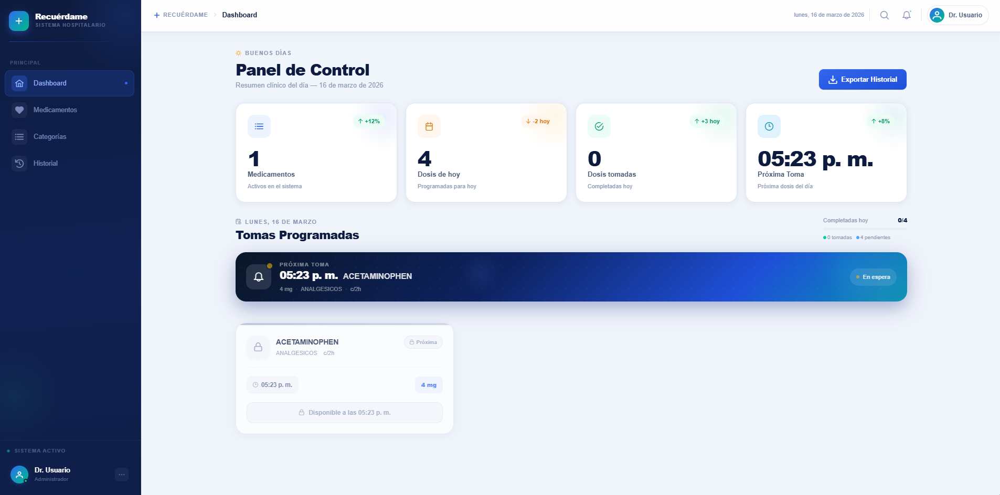
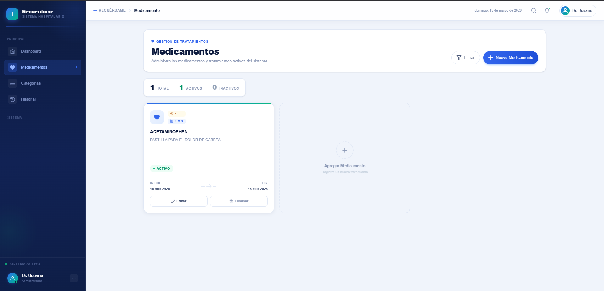
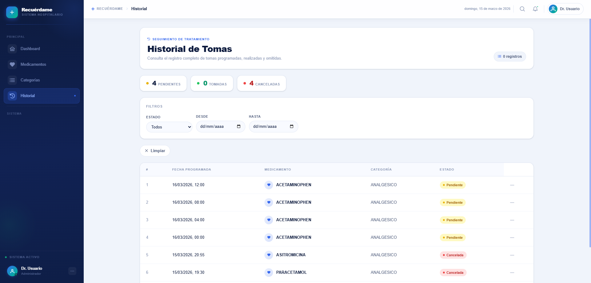

# Recuérdame 💊

**Recuérdame** es una aplicación web para el seguimiento y recordatorio de medicamentos. Permite registrar los medicamentos que debe tomar un paciente, configurar su dosis y frecuencia, y hacer un seguimiento de las tomas programadas para asegurarse de que ninguna se pase por alto.

## ¿Qué hace?

- Registra medicamentos con nombre, dosis, frecuencia y fechas de inicio/fin.
- Organiza los medicamentos por categorías.
- Genera y gestiona tomas programadas automáticamente.
- Registra el estado de cada toma (tomada, pendiente, omitida).

## Stack Tecnológico

| Capa          | Tecnología          |
| ------------- | ------------------- |
| Backend       | ASP.NET Core (C#)   |
| Frontend      | Vue.js + TypeScript |
| Base de datos | SQL Server          |
| Despliegue    | Docker + Nginx      |

## Screenshots

### Panel de Control


### Medicamentos


### Historial de Tomas


## Inicio Rápido

```bash
# Levantar todos los servicios con Docker
docker-compose up --build
```

La aplicación estará disponible en `http://localhost`.
